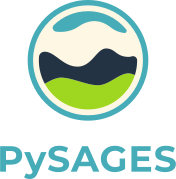

<h1 align="center">
  

    
  

   
  

    
    &nbsp;
    
    &nbsp;
    
    &nbsp;
    
  

</h1>

PySAGES (Python Suite for Advanced General Ensemble Simulations) is a Python
implementation of [SSAGES](https://ssagesproject.github.io) with support for GPUs.

## Installation

PySAGES currently supports [HOOMD-blue](https://glotzerlab.engin.umich.edu/hoomd-blue),
[LAMMPS](https://www.lammps.org), [ASE](https://wiki.fysik.dtu.dk/ase/index.html), and
[OpenMM](https://openmm.org). We plan to add support for other engines that have a python
API, including those supported by the original SSAGES.

Before installing PySAGES, you need to install one of the following plugins, depending on
your molecular dynamics engine of choice:

- [DLPack Plugin for HOOMD-blue](https://github.com/SSAGESLabs/hoomd-dlext)
- [DLPack Plugin for OpenMM](https://github.com/SSAGESLabs/openmm-dlext)
- [DLPack Plugin for LAMMPS](https://github.com/SSAGESLabs/lammps-dlext)
- No plugin needed for ASE

You also need to install [JAX](https://github.com/google/jax), a library for
high-performance numerical computing. Follow their installation guide and make sure you
have it installed before using PySAGES. Depending on your local setup, you may need
to install the CPU version or the CUDA compatible version.

For GPU support, JAX and any backend (HOOMD-blue, LAMMPS, or OpenMM) need to be built or
installed with CUDA support.

You can follow our installation tutorial on Google Colab to see how PySAGES, HOOMD-blue,
and OpenMM can be built and installed in such an environment.
[![Colab Badge]][Install Notebook]

## Usage

PySAGES provides a straightforward interface to set up collective variables and enhanced
sampling methods in your MD simulations. See the
[documentation](https://pysages.readthedocs.io/en/latest) to learn more.

We provide ready-to-go examples for common methods. Check out the [examples](examples/)
subfolder to look at different script and notebook examples. These include pre-set
simulations and a tutorial on how to install PySAGES along with the supported MD engines.

## Development

We believe in good software engineering and collaboration. We welcome all contributions.
To ease collaboration, we use [trunk](https://trunk.io) as a development tool free for
open-source software. This includes version-checked linters that can be run automatically.
We ship a launcher for trunk with this repo: `./trunk`, no installation required. For
details about how to use `./trunk fmt` to format existing code into this style and
`./trunk check` to verify a consistent code style, check out the [trunk documentation
page](https://docs.trunk.io/docs).

<!-- References -->

[Colab Badge]: https://colab.research.google.com/assets/colab-badge.svg
[Install Notebook]: https://colab.research.google.com/github/SSAGESLabs/PySAGES/blob/main/examples/Install_PySAGES_Environment.ipynb
